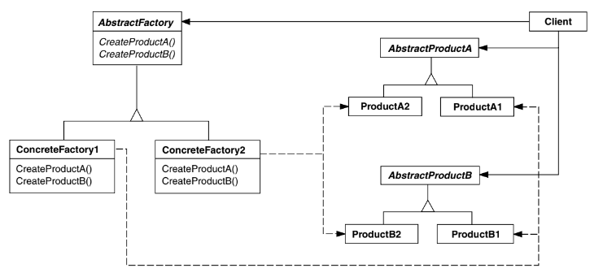

# Intenção

Fornecer uma interface para a criação de famílias de objetos relacionados ou
dependentes sem especificar suas classes concretas.

# Classificação

O padrão Abstract Factory é um padrão criacional de objetos.

# Diagrama

# Neste exemplo:

Temos uma fábrica de veículos que fabrica os produtos Carro e Caminhão, nas famílias
elétrico e movido a combustão. O padrão nos fornece um meio de instanciar veículos da
mesma família sem termos que especificar isto a cada criação.

- Car e Truck são as interfaces para os produtos
- Os produtos concretos implementam os métodos da interface de acordo com suas famílias
- VehicleFactory define métodos para a criação de produtos
- As fábricas concretas instanciam apenas produtos de uma família específica

O método buildVehicles precisa apenas de uma fábrica e é capaz de executar suas operações
independentemente da família de produtos. É garantido que todos os produtos serão da mesma
família