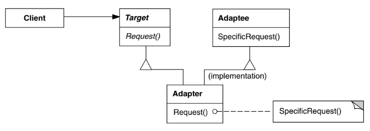
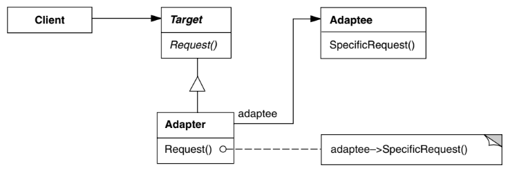

# Intenção

Converter a interface de uma classe em outra interface, esperada pelos clientes. O adapter permite
que classes com interfaces incompatíveis trabalhem em conjunto - o que, de outra forma, seria impossível

# Classificação

O padrão Adapter é um padrão estrutural de classes e de objetos

# Diagrama

### Adaptador de classe

### Adaptador de objeto

# Neste exemplo

Temos um sistema que precisa de um processador de pagamentos porém o que temos é legado e tem uma interface
diferente. O adapter será utilizado para tornar possível o uso do provedor de pagamentos legado pelo novo sistema

- PaymentProcessor é a interface do novo sistema
- NewPaymentProcessor é a classe que se implementa o novo sistema de pagamentos
- LegacyPaymentProvider é a interface no sistema legado
- LegacyPaymentProviderImpl é a classe que representa o antigo sistema
- LegacyPaymentAdapter é o adaptador. Ele deve implementar a interface do sistema moderno. Ele também
  deve ter uma referência para o antigo sistema, recebendo essa referência pelo construtor. Dentro de
  cada método da interface do novo sistema, você deve realizar as operações correspondentes no antigo
  sistema.