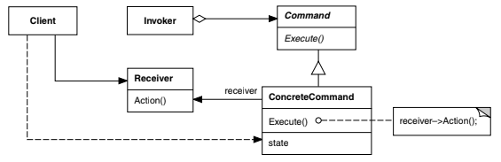

# Intenção

Encapsular uma solicitação como um objeto, desta forma permitindo parametrizar clientes
com diferentes solicitações, enfileirar ou fazer o registro (log) de solicitações e
suportar operações que podem ser desfeitas.

# Classificação

O padrão Command é um padrão comportamental de objetos.

# Diagrama

# Neste exemplo:

Temos um aparelho de som e um controle remoto genérico. A configuração das ações de
cada botão é personalizável, e por isso não podemos associar diretamente um botão a cada
ação do aparelho de som.

Note que, da forma que o controle foi construído, seu código não precisa ser modificado
quando novos comandos forem criados

- Stereo é a nossa classe Receiver. Ela é a **receptora** final das solicitações, e
  contém o código que sabe como executá-las.
- Command define uma interface para todos os comandos.
- Remote Control é o Invoker. Ele recebe a interação do usuário e apenas aciona
  o comando que estiver designado para o botão.
- Os comandos concretos têm uma referência para o Receiver e, no método execute, realizam
  as operações necessárias para que a solicitação seja executada. No método undo, eles
  desfazem o que é feito no método execute