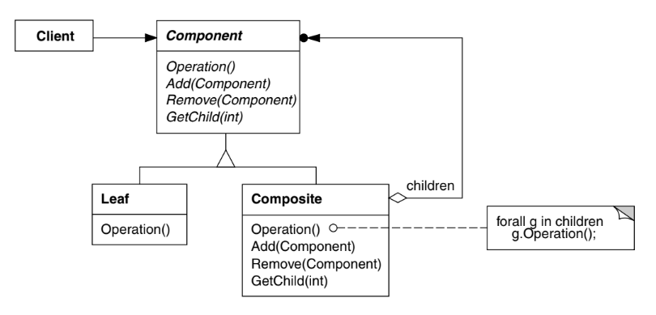

# Intenção

Compor objetos em estruturas de árvore para representarem hierarquias parte-todo. O padrão
Composite permite aos seus clientes tratarem de maneira uniforme objetos individuais e
composições de objetos

# Classificação

O padrão Composite é um padrão estrutural de objetos

# Diagrama

# Neste exemplo

- FileSystemComponent define a interface para todos os componentes do sistema de arquivos, sejam
eles diretórios ou arquivos. Além das operações para os componentes, essa interface define métodos
de adição, remoção e busca de componentes filhos
- File é o componente folha que implementa a operação e, para os métodos que são exclusivos de nós,
lança exceções
- Directory é o componente nó que deve ter uma lista de objetos folha. Na operação, deve ser feita
uma iteração sobre todos os elementos da lista chamando a mesma operação