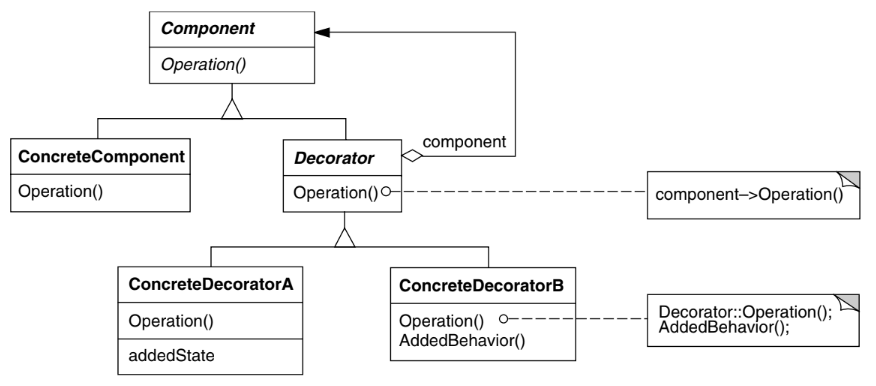

# Intenção

Dinamicamente, agregar responsabilidades adicionais a um objeto. Os Decorators fornecem
uma alternativa flexível ao uso de subclasses para extenção de funcionalidades

# Classificação

O padrão Decorator é um padrão estrutural de objetos

# Diagrama

# Neste exemplo

Temos um sistema que produz café. O produto básico pode ser decorado com leite ou creme apenas
realizando uma reatribuição de valor à referência do objeto

- Coffee representa a interface do componente base
- SimpleCoffee é a representação mais básica do componente
- CoffeeDecorator é uma classe abstrata que implementa a interface do componente base.
  Ele deve ter uma referência para um objeto Coffee e recebê-la pelo construtor. Para todos
  os métodos da interface, ele deve apenas chamar o mesmo método na referência que ele mantém.
- MilkDecorator e CreamDecorator herdam de CoffeeDecorator e chamam o construtor da classe pai. Para os
  métodos da interface, eles chamam o mesmo método do super e acresentam a decoração.