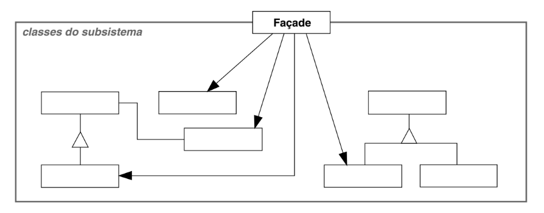

# Intenção

Fornecer uma interface unificada para um conjunto de interfaces em um subsistema. O padrão
Facade define uma interface de nível mais alto que torna o subsistema mais fácil de ser usado

# Classificação

O padrão Facade é um padrão estrutural de objetos

# Diagrama

# Neste exemplo

Temos vários subsitemas que realizam operações sobre pedidos. A fachada simplifica a interação
do usuário com esses subsistemas

- OrderFacade unifica os subsistemas, permitindo ao usuário interagir com eles de forma simplificada