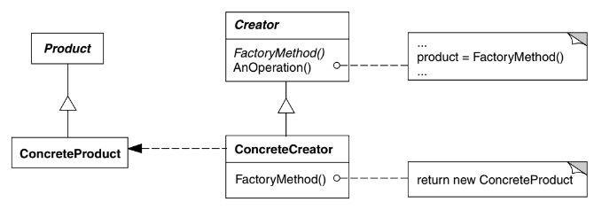

# Intenção

Definir uma interface para criar um objeto, mas deixar as subclasses decidirem que classe
instanciar. O Factory Method permite adiar a instanciação para subclasses

# Classificação

O Factory Method é um padrão criacional de classes

# Diagrama

# Neste exemplo

Temos um método (que poderia ser todo um programa) que realiza suas operações com um objeto Vehicle.
Com o padrão, o método não se preocupa com o tipo de objeto que irá receber, e esse tipo depende apenas
do tipo da fábrica que for fornecida.

- Vehicle define a interface para todos os produtos
- Car e Motorcycle são os produtos concretos
- VehicleCreator é o criador, que define o método que cria os produtos. Note que o criador pode
  ser uma classe comum, que define um tipo padrão para os produtos e realiza todas as operações.
  Neste caso, criadores para outros tipos sobrescrevem o método fábrica e retornam objetos de seu
  tipo correspondente
- As fábricas concretas retornam novos objetos de seus tipos correspondentes