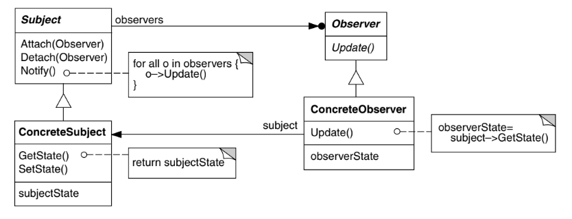

# Intenção

Definir uma dependência um-para-muitos entre objetos, de maneira que quando um objeto muda
de estado todos os seus dependentes são notificados e atualizados automaticamente

# Classificação

O padrão Observer é um padrão comportamental de objetos

# Diagrama

# Neste exemplo

Temos um sistema de monitoramento meteorológico e toda vez que as condições meteorológicas
mudarem os observadores deverão ser notificados

- Observable define uma interface para os subjects que podem ser observados. Ela possui os
métodos de adição e remoção de observadores, além do método que notifica os observadores
registrados
- Observer define uma interface para todos os observadores. Ela possui o método que, recebendo
o estado atual do subject, realiza alguma operação com base nisso
- WeatherData é o subject que é observado. Ele deve possuir uma lista de observadores e implementar
os métodos de Observable. No método de notificar, deve-se iterar pela lista de observadores invocando
o método update de cada um deles. Sempre que o estado observado mudar, o método de notificação deve ser
chamado
- CurrentConditionsObserver é o observador, que atualiza o display sempre que as condições mudam