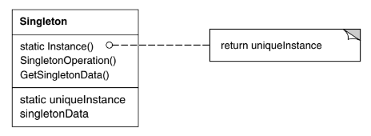

# Intenção

Garantir que uma classe tenha somente uma instância e fornecer um ponto global de
acesso para a mesma

# Classificação

O padrão Singleton é um padrão criacional de objetos

# Diagrama

# Neste exemplo

Temos uma aplicação que realiza uma conexão com um banco de dados. Na aplicação, basta
que haja apenas uma conexão com o banco, e por isso usamos o padrão Singleton. O uso de
double-check locking é para evitar que a sincronização do método getInstance seja feita
em todas as chamadas.

- DatabaseConnection é a classe que queremos garantir a existência de uma única instância
- O construtor dessa classe é privado e, para obter a instância, é necessário recorrer ao
  método getInstance
- Não importa quantas vezes você chame getInstance(), o objeto de conexão sempre será o mesmo