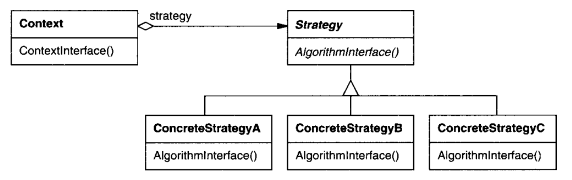

# Intenção

Definir uma família de algoritmos, encapsular cada um deles e torná-los intercambiáveis.
O padrão Strategy permite que o algoritmo varie independentemente dos clientes que o utilizam

# Classificação

O padrão Strategy é um padrão comportamental de objetos

# Diagrama

# Neste exemplo

Temos um sistema de vendas que lida com pagamentos tanto por cartão de crédito quanto por Pix.
A estratégia de pagamento das vendas pode mudar em tempo de execução de forma transparente para
o usuário

- PaymentStrategy define uma interface para todas as classes que definirão métodos de pagamento
- CreditCardPayment e PixPayment são as implementações das diferentes estratégias de pagamento
- PaymentProcess é o contexto onde o método definido pela estratégia é utilizado. Ele deve possuir
  uma referência para a interface da estratégia, um método setter e um método que invoca o método da
  estratégia. É opcional inicializá-lo com uma estratégia padrão via construtor