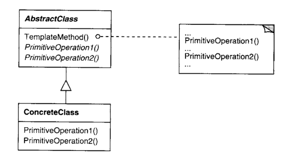

# Intenção

Definir o esqueleto de um algoritmo em uma operação, postergando alguns passos para as
subclasses. Esse padrão permite que subclasses redefinam certos passos de um algoritmo
sem mudar a estrutura mesmo.

# Classificação

O padrão Template Method é um padrão comportamental de classes

# Diagrama

# Neste exemplo

Temos um processador de documentos abstrato cujo método template é processDocument. Esse
método possui uma estrutura definida, mas alguns passos do algoritmo podem mudar a depender
do tipo de documento. Assim, existem métodos abstratos que devem ser implementados pelas
subclasses de acordo com suas necessidades. Além disso, há métodos cuja implementação é
opcional.

- DocumentProcessor é a classe abstrata que contém o método template e declara os métodos
  abstratos
- As classes que extendem DocumentProcessor implementam os métodos abstratos e os opcionais
  caso seja necessário